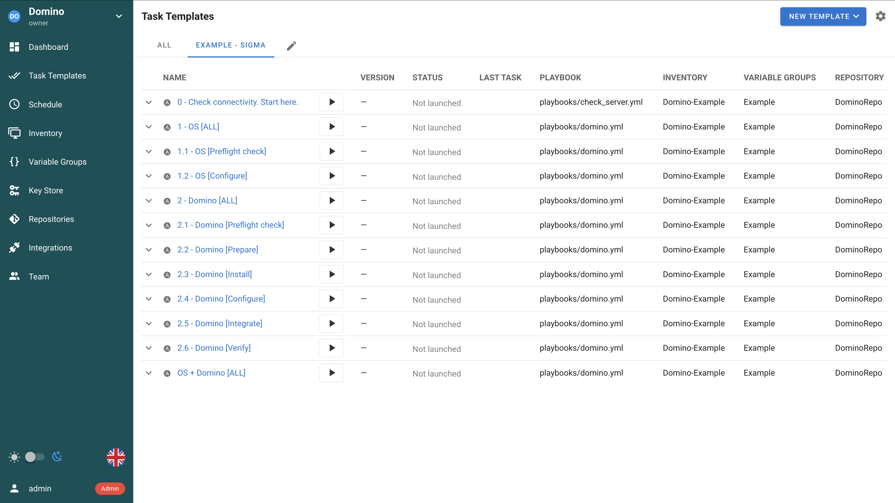
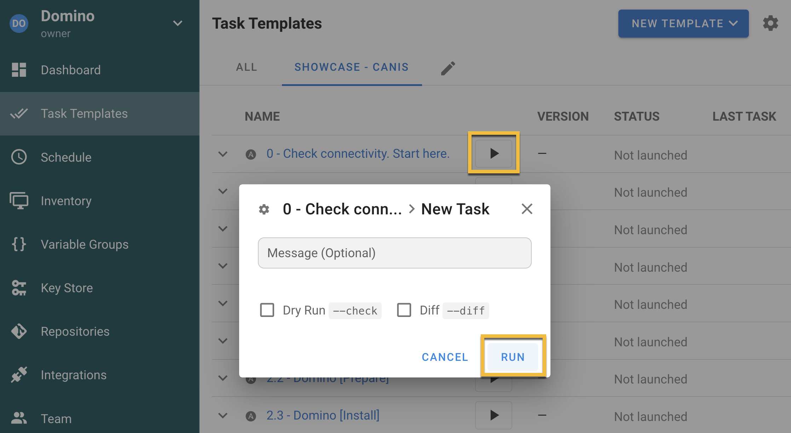
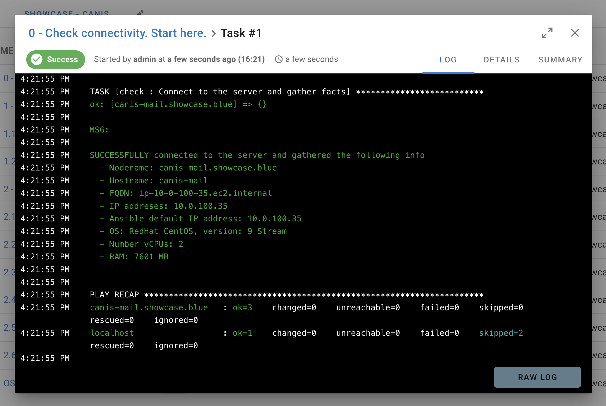
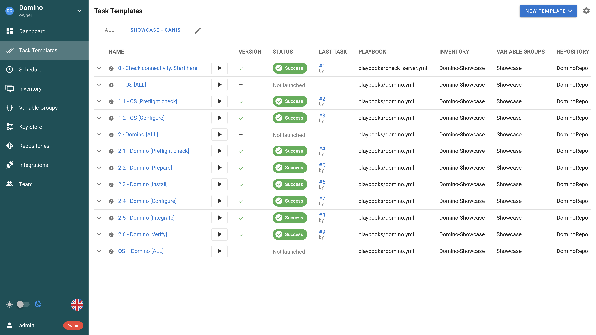

## Quickstart

You should start here. These steps will guide you through the initial tool configuration and deploying your first Domino server. Subsequent use of the script will follow the same pattern, although the configuration will likely be more detailed and customized to your specific needs.

When running the script for the first time, deploy only test servers on test virtual machines.


### Prerequisites
- Install **Docker** on your workstation.
- Create your **virtual machine** (VM) with Linux (the script is tested on CentOS 9 Stream, Rocky Linux 9, Ubuntu 24.04).
- Configure **SSH access** to the VM using a certificate. Store the parameters in `~/.ssh/config` so that you do not need to specify the username and key file for every connection. \
You should be able to connect to the VM with this simple command:
  ```
  ssh <your_vm_hostname>
  ```
  Example: `ssh sigma.example.com`


### Obtain the Script
- **Clone this repository** to your workstation. The best way is to use `git` coomand:
    ```
    git clone https://github.com/HCL-TECH-SOFTWARE/Domino-Automation
    ```


### Software Installers
- **Choose a folder** on your local workstation where you will store installation packages for the products you plan to deploy (Domino, Traveler, Nomad, etc.).
You can use the `software/` subfolder inside the repository.

- Put the software installers into this folder.


### Configure Your Inventory
- Inventory files are stored in the `inventory/` folder.

- **Create** your inventory file by copying the example file `inventory-example.yml`. Name your file as `inventory-<your_domino_domain>.yml`.

- **Edit** your inventory file:
  - Replace *alpha.example.com* with the hostname of your VM.
  - `ansible_user`: set the username you use for SSH connectivity to your VM.
  - `ansible_ssh_private_key_file`: set the path to your SSH keys.
    > [!NOTE]
    > The username and key file should match the values in your `.ssh/config` file.


### Configure Your Domino Server
- Each VM has its configuration directory located in `inventory/host_vars`.

- **Create** a new directory that will contain parameters for your Domino server. The name of the directory must match the VM hostname. \
You can clone the example directory *sigma.example.com* and edit the values. \
  > [!NOTE]
  > There are multiple directories with example server configuration. Sigma is the simplext, with just a few mandatory parameters.

- Edit the `domino.yml` file inside the newly created directory and replace the default values with your own.


### Configure and Start Semaphore
- **Edit parameters** in the Semaphore config file `semaphore/.env`.
You need to update `SOFTWARE_DIRECTORY` parameter — set it to the folder where the software installers are stored (the one from the previous section). \
Changing other parameters is optional.
- **Start** the Semaphore container:
  ```
  ./semaphore.sh start
  ```
- **Create documents** in Semaphore to perform the initial project configuration and generate task documents for Domino installation:
  ```
  ./semaphore.sh create <your_vm_hostname>
  ```
  Example:
  ```
  ./semaphore.sh create sigma.example.com
  ```
- Access the Semaphore UI. Get the URL and credentials with this command:
  ```
  ./semaphore.sh info
  ```
  The default URL is http://localhost:3000/. \
  Username and password are specified in `semaphore/.env`.
- Examine the Semaphore user interface, especially the *Task Templates* section. It contains the task documents you will run.

  

> [!NOTE]
> If needed, you can reset and recreate the Semaphore configuration — useful when tuning the initial setup. Run the following commands:
  ```
  ./semaphore.sh reset
  ./semaphore.sh start
  ./semaphore.sh create <your_vm_hostname>
  ```

### Run Tasks One by One
- In the Semaphore UI, go to *Task Templates* and select the view for your server (example: `EXAMPLE - SIGMA`)

- Launch tasks in the specified order. Start with the task named `0 - Check connectivity. Start here.`

- Lauch each task by clicking the arrow button and confirm with the *RUN* button.
  

- Each task runs on the frontend; you can see all the steps and their results.
  

- When a task finishes **successfully**, proceed to the next one. \
  Example: After task `1.1` run task `1.2`.

- When a task finishes **with an error**, you must fix the issue before continuing. Usually, the issue is caused by an incorrect parameter in `domino.yml` config file in your inventory folder.

- You can the status of each task (success / failure) in the Tasks view. Do not proceed to the next task until the previous one finishes successfully.
  

> [!IMPORTANT]
> All tasks are idempotent — you can run them multiple times, and they will produce the same result each time.
